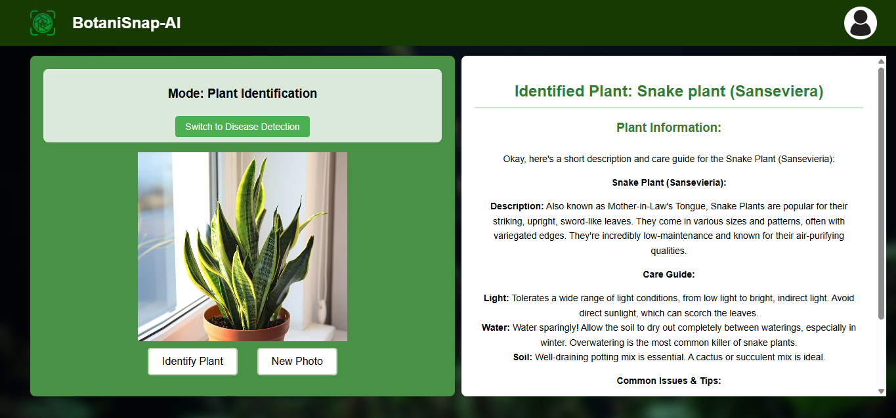
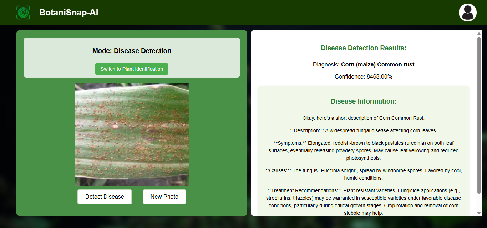
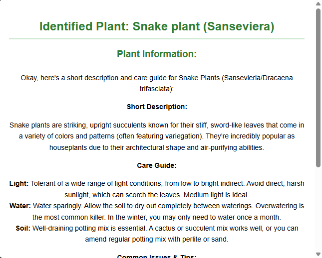

# TC-3202 [BotaniSnap-AI]

<p align="center">
  
</p>


## Table of Contents
- [Introduction](#introduction)
- [Project Overview](#project-overview)
- [Objectives](#objectives)
- [Features](#features)
- [Technologies Used](#technologies-used)
- [Setup and Installation](#setup-and-installation)
- [Usage Instructions](#usage-instructions)
- [Project Structure](#project-structure)
- [Contributors](#contributors)
- [Chagelog](#changelog)
- [Acknowledgments](#acknowledgments)
- [License](#license)

---

## Introduction
BotaniSnap-AI is a web application designed to help users identify plants and detect plant diseases with just a photo. Whether you're a gardening enthusiast, a student, or someone curious about plants, BotaniSnap-AI makes it easy to learn more about plant types and how to care for them. With the power of AI, it brings plant knowledge to your fingertips.

## Project Overview
BotaniSnap-AI was created to make plant identification and health monitoring simple and accessible. Many people struggle to recognize plant species or understand what’s wrong with their plants when they look unhealthy. This app solves that problem by allowing users to upload an image or take a picture using their webcam. It then uses AI to identify the plant, detect any visible diseases, and offer a short description along with basic care tips.

The app is especially useful for:

- Home gardeners and plant lovers

- Students or educators in botany or biology

- Anyone wanting to take better care of their indoor or outdoor plants

In real-world use, BotaniSnap-AI can help reduce the spread of plant diseases, support healthy plant growth, and make plant learning fun and interactive for all ages.


## Objectives
- Develop an easy-to-use tool that helps users identify plant species using images.

- Implement a feature that detects possible plant diseases from a photo.

- Provide useful information about the plant, including a short description and care tips.

- Allow users to take pictures directly from their webcam or upload from their device.

- Test the app to make sure the plant recognition and disease detection are accurate and helpful.

## Features
- Plant Identification: Upload or capture an image to find out the name of a plant.

- Disease Detection: Automatically check for signs of plant diseases in the uploaded or captured image.

- Care Tips: Get basic information about the plant, including how to care for it.

- Webcam Support: Take real-time pictures using your webcam to identify plants instantly.

- Simple UI: Clean and user-friendly design for easy navigation and use by anyone.

## Technologies Used
Mention the tools, frameworks, and technologies used in the project:
- Programming Languages: [Python, JavaScript]
- Frameworks/Libraries: [React, Flask]
- Databases: [Firebase ]
- Other Tools: [Git, react-webcam, etc.]

## Setup and Installation
Step-by-step instructions for setting up the project locally.

1. **Clone the repository:**
   ```bash
   https://github.com/thebadsektor/tc3202-3b-4.git
   cd tc3202-3b-4
   ```
2. **Backend Setup:**
- Navigate to the backend folder:
   ```bash
   cd backend
   ```
- Create and activate a virtual environment:
  - On Windows:
   ```bash
   python -m venv venv
   . venv\Scripts\activate
   ```
   - On macOS/Linux:
   ```bash
   python3 -m venv venv
   source venv/bin/activate
   ```
- Install the required Python packages:
   ```bash
   pip install -r requirements.txt
   ```
- Run the backend server:
   ```bash
   python app.py
   ```

3. **Frontend Setup:**
- Open a new terminal and go to the frontend folder:
   ```bash
   cd frontend
   ```
- Install the frontend dependencies:
   ```bash
   npm install
   ```
- Start the React development server:
   ```bash
   npm start
   ```

4. **Run the project:**
   - Once both the backend and frontend are running:
     - You can now access the BotaniSnap-AI web app in your browser at:
   ```bash
   http://localhost:3000
   ```
   - Upload or capture a plant photo to:
     - Identify the plant species
     - Detect potential diseases
     - Get care tips and descriptions instantly!

**Note:** If your project has external depencies like XAMPP, MySQL, special SDK, or other environemnt setup, create another section for it.

## Usage Instructions
Once the app is running:
- Identify Plants:
   - Click on "Open Camera" to use your webcam or "Upload Photo" to choose an image from your device.
   - he app will display the plant name, short description, and care tips about your.
- Disease Detection:
   - Switch to "Disease Detection" mode.
   - Upload or capture a leaf photo.
   - The app will show any detected diseases, a short explanation, and care recommendations.

- Example commands or API calls.
Step 1: Open a New Terminal and Navigate to the Backend Folder
   ```bash
   cd backend
   ```
Step 2: Activate the Virtual Environment
   - On Windows:
   ```bash
   . venv\Scripts\activate
   ```
   - On macOS/Linux:
   ```bash
   source venv/bin/activate
   ```
Step 3: Enter the cURL Command to Test Plant Identification
   ```bash
   curl -X POST http://localhost:5000/predict -F "file=@\"path_to_your_image""
   ```
- Replace path_to_your_image with the actual path to the image you want to test, for example:
   ```bash
   curl -X POST http://localhost:5000/predict -F "file=@\"C:/Users/Admin/Desktop/Plants/AloeVera.jpg\""
   ```
   Sample output
   ```json
      {
      "accuracy": 99.74,
      "message": "Identified plant as Aloe Vera with 99.74% accuracy",
      "plant_info": {},
      "predicted_plant": "Aloe Vera",
      "top_predictions": [
         {
            "accuracy": 99.74,
            "plant_name": "Aloe Vera"
         },
         {
            "accuracy": 0.13,
            "plant_name": "Birds Nest Fern (Asplenium nidus)"
         },
         {
            "accuracy": 0.04,
            "plant_name": "Cast Iron Plant (Aspidistra elatior)"
         }
      ]
   }
   ```
- **Database Used:** [Firebase](https://firebase.google.com/)

### Plant Identification Example


### Disease Detection Example


### Gemini-generated Care Tips
<p align="center">
  
</p>


## Project Structure
Explain the structure of the project directory. Example:
```bash
.
├── 📂 backend/
│   ├── 📂 model/
│   │   └── plant_identification_model.h5
│   ├── 📂 venv
│   ├── requirements.txt
│   └── app.py
├── 📂 frontend/
│   ├── 📂 node_modules
│   ├── 📂 public
│   ├── 📂 src/
│   │   ├── AboutPage.css
│   │   ├── AboutPage.js
│   │   ├── App.css
│   │   ├── App.js
│   │   ├── App.test.js
│   │   ├── Create.css
│   │   ├── Create.js
│   │   ├── firebaseConfigs.js
│   │   ├── index.css
│   │   ├── index.js
│   │   ├── Landingpage.css
│   │   ├── Landingpage.js
│   │   ├── Login.css
│   │   ├── Login.js
│   │   ├── reportWebVitals.js
│   │   ├── setup.js
│   │   ├── splashscreen.css
│   │   └── splashscreen.js
│   ├── package-lock.json
│   └── package.json
├── LICENSE.txt
└── README.md
```


## Contributors

List all the team members involved in the project. Include their roles and responsibilities:

- **[Cantal, Marc Airon T.]**: Lead Developer, Backend Developer
- **[Salabsab, Ridchard Sean]**: Frontend Developer, UI/UX Designer
- **[Mangalindan, Giro]**: Documentation, Grapics
- **[Canaling, John Jasper]**: Documentation, Research Support
- **Gerald Villaran**: Course Instructor

## Project Timeline

Outline the project timeline, including milestones or deliverables. Example:

- **Week 1-2**: Research and project planning.
- **Week 3-5**: Design and setup.
- **Week 6-10**: Implementation.
- **Week 11-12**: Testing and debugging.
- **Week 13-14**: Final presentation and documentation.

- **Week 1-2**: Research and Project Planning
Includes initial exploration of datasets and preliminary setup for the machine learning model.

- **Week 3-4**: Design and Setup
Covers UI/UX planning, system architecture design, and development environment configuration.

- **Week 5-6**: Training Our Model
Involves data preprocessing, model selection, and training the machine learning model using selected datasets.

- **Week 7-10**: Implementation
Development of core features, frontend-backend integration, and ML model integration.

- **Week 11-12**: Testing and Debugging
Functionality testing, bug fixing, and performance optimization.

- **Week 13-14**: Final Presentation and Documentation
Completion of project reports, presentation materials, and user documentation.

## Changelog


### [Version 1.0.0] - 2025-00-00
Implemented plant identification using a custom-trained model.

Added image upload via the web interface and displayed prediction results.

Enabled classification for common houseplants.

### [Version 1.1.0] - 2025-00-00
Improved user interface for plant result display.

Updated documentation with setup, usage instructions.

### [Version 1.2.0] - 2025-00-00
Integrated disease detection using Hugging Face model.

Refactored Flask backend for faster API response and better error handling.

### [Version 1.3.0] - 2025-00-00
Integrated Gemini 2.0 Flash API for plant descriptions and care tips.

Added dynamic care guides and common issue info per predicted plant/disease.

Enhanced UI to show AI-generated plant care details.

### [Version 1.4.0] - 2025-00-00
Added user login (basic authentication).

Optimized image preprocessing and model loading on backend.

## Acknowledgments

[Mr.Gerald Villaran] for guidance and support throughout the development process.

This project was built from [BotaniSnap-AI](https://github.com/thebadsektor/tc3202-3b-4.git), created by [Group 4]. You can view the original repository [here](https://github.com/thebadsektor/tc3202-3b-4.git).

Hugging Face for the plant disease detection model and resources for image classification.

Google Generative AI (Gemini) for the plant care tips and descriptions.

## License

This project is licensed under the MIT License - see the LICENSE file for details.

The MIT License allows anyone to use, modify, and distribute this software freely, including for commercial purposes, as long as the copyright notice and permission notice are included in all copies or substantial portions of the software. This software is provided "as is", without warranty of any kind.

This section references your license file and gives a clear explanation of the terms, as per the MIT License. You can link it to the actual LICENSE file in your repository for users to easily access the full terms.